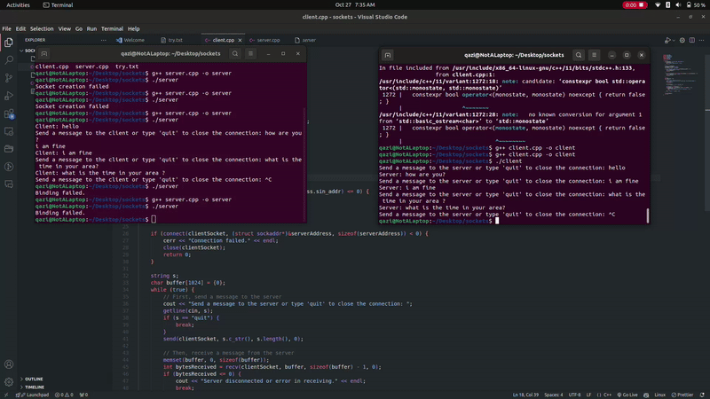

# Inter Process Communication Across LAN

## 📌 Overview

This project demonstrates **Inter-Process Communication (IPC) across a Local Area Network (LAN)** using **Sockets**. It enables multiple processes running on different machines within the same network to communicate efficiently.

## 🎥 Project Demonstration

  

Click [here](assets/working.webm) to view the full video.
## ⚡ Features

- Communication between processes across different machines in a LAN.
- Efficient data transmission using **TCP sockets**.
- Support for multiple clients communicating with a server.
- Secure and reliable message exchange.
- Scalable and adaptable for various IPC use cases.

## 🛠️ Technologies Used

- **Programming Language:** C++
- **Networking Protocol:** TCP/IP
- **Operating System:** Linux/Windows (via MinGW for Windows)

## 🚀 Installation & Setup

### Prerequisites

- Ensure all machines are connected to the same LAN.
- Install a C compiler such as **GCC**.
- Allow network communication through firewalls if necessary.

### Steps

1. **Clone the Repository**
   ```sh
   git clone https://github.com/Qazi-Talha-Ali-00/Inter_Process_Communication_Across_LAN.git
   cd Inter_Process_Communication_Across_LAN


2. **Compile the Server and Client**
   ```sh
   g++ server.cpp -o server
   g++ client.cpp -o client


3. **Run the Server**
   ```sh
   ./server

4. **Run the Client**
   ```sh
   ./client
